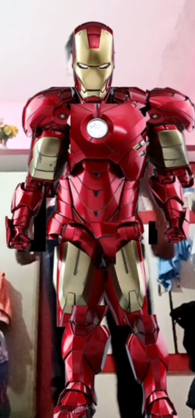

# 🦾 Become Ironman
# Hi I'm Aman!

Have you ever seen Snapchat or Instagram filters that add cartoons, masks, or funny ears on your face?
My project takes this idea to the next level!
Transform yourself into Iron Man in real-time! This web-based computer vision project uses your webcam to overlay a full Iron Man suit onto your body with live video tracking.

## ✨ Features

- 🎥 **Real-time full-body tracking** - Instant suit overlay on your entire body
- 🚀 **Zero installation required** - Runs directly in your browser
- ⚡ **Live video processing** - Smooth, responsive Iron Man transformation
- 🎮 **Simple to use** - Just allow camera access and you're Iron Man!

## 🎯 What Makes This Different?

Unlike simple face filters, this project tracks and transforms your **entire body** into Iron Man - not just your face. Experience the full superhero transformation in real-time!

## 🚀 Quick Start

1. **Clone the repository**
   ```bash
   git clone https://github.com/amanmaurya121212/Become_ironman.git
   cd Become_ironman
   ```

2. **Open in VS Code or any IDE**
   ```bash
   code .
   ```

3. **Run the project**
   - Open `index.html` in your browser, OR
   - Use Live Server extension in VS Code
   - Allow camera permissions when prompted

4. **Become Iron Man!** 🎉

## 💻 Technologies Used

- JavaScript
- HTML5 Canvas
- WebRTC (Camera Access)
- [Add specific libraries: postnet/ ml5.js ]

## 📋 Prerequisites

- Modern web browser (Chrome, Firefox, Safari, or Edge)
- Webcam
- Good lighting for better tracking

## 🎮 Usage

1. Open the application in your browser
2. Grant camera access when prompted
3. Step back so your full body is visible in the frame
4. Watch yourself transform into Iron Man in real-time!

## 📸 Demo
<p align="center">
  
</p>


## 🤝 Contributing

Contributions, issues, and feature requests are welcome! Feel free to check .

## 👨‍💻 Author

**Aman**

- GitHub:https://github.com/amanmaurya121212

## ⭐ Show your support

Give a ⭐️ if you like this project!

---

**Note:** This project requires camera access to function. Your video is processed locally in your browser - nothing is uploaded or stored.
